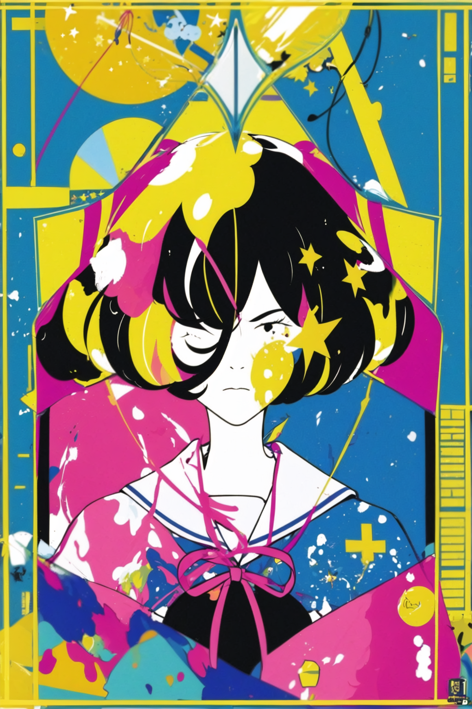

# Nakamura Yusuke / Yojouhan / Yoru wa Mijikashi / Asian Kungfu Generation Album artwork Styled Lora

This is an stable diffusion lora model, the training dataset with tag words have been placed in training set file. If you would like to use this model just use the safetensors with weight:1 would be ok.
If you would like to train by you own you could use the json file, I have used Aki's toolkit to train this lora. https://github.com/Akegarasu/lora-scripts
The base model checkpoint is Anylora(LCM), https://civitai.com/models/23900?modelVersionId=256685, this lora perform best in this checkpoint.

## Output without other lora
 

## Output with other lora
This model also support with other character's lora.
Yojouhan's Akashi
 
 
 
Bocchi the rock's Goto Hitori
 
 
Hastune Miku 
 
 

## Output by different checkpoint

If you need my showcase tagger, check out my Civitai :)
